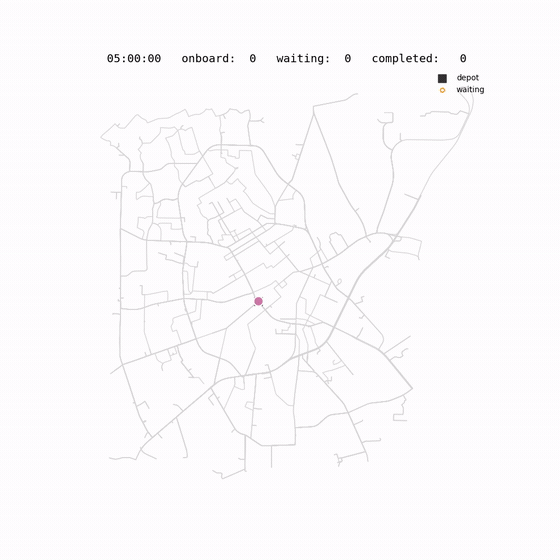

# RTV Solver

An online solver for the **Pickup-and-Delivery Problem with Time Windows (PDPTW)**,
built for paratransit / dial-a-ride fleets. Requests are matched to vehicles with the
**RTV (Request–Trip–Vehicle)** method: feasible shared trips are enumerated, priced per
vehicle, and assigned by solving a set-partitioning ILP with Gurobi. An insertion
heuristic is included as a fast fallback.

## Requirements

- Python >= 3.10
- [Gurobi](https://www.gurobi.com/) with a license large enough for the assignment ILP
- A running **OSRM** routing server (see [Set up the OSRM server](#set-up-the-osrm-server))

## Setup

No install or packaging step is needed — the solver runs as standalone Python from the
repository root. Clone the repo and install the dependencies:

```
pip install -r requirements.txt
```

Then import it from the repository root:

```python
from rtv_solver import OnlineRTVSolver
```

## Tutorial

The quickest way to learn the API is the [`example.ipynb`](example.ipynb) notebook — a
guided, runnable tutorial that walks the full online dispatch loop (load a payload,
solve batches with the heuristic and RTV, simulate the fleet forward, check feasibility,
serve-ASAP fallback, re-optimize, and read service metrics) against the bundled sample
data. Start OSRM, then run it from the repository root:

```
jupyter notebook example.ipynb
```

The sections below are the reference for everything the tutorial demonstrates.

---

## 1. Generating input data

Every solver call takes a single **payload** dictionary with three keys: `depot`,
`requests`, and `driver_runs`. All times are **integer seconds since midnight**
(e.g. `5*3600+30*60` = 05:30:00). Capacities are split into `am` (ambulatory seats)
and `wc` (wheelchair seats), tracked independently.

Ready-made **synthetic** example payloads (pickled) live in `inputs/wilson/`. Pickup and
dropoff locations are sampled at random inside Wilson, NC and snapped to the road network;
times are randomized over the service day. They contain no real/private data:

| File | Requests | Vehicles |
| --- | --- | --- |
| `sample1.pkl` | 100 | 4 (used by `example.ipynb`) |
| `sample2.pkl` | 150 | 4 |
| `sample3.pkl` | 200 | 5 |

```python
import pickle

with open("inputs/wilson/sample1.pkl", "rb") as f:
    payload = pickle.load(f)

payload.keys()  # dict_keys(['requests', 'depot', 'driver_runs'])
```

Regenerate (or make more) with the included script — it needs a running OSRM server to
snap coordinates to routable points:

```
python scripts/generate_sample_data.py --server-url http://127.0.0.1:50000/
```

The generator works for **any city**: pass its bounding box and a central depot, and
point `--server-url` at an OSRM server that covers the region.

```
python scripts/generate_sample_data.py \
    --server-url http://127.0.0.1:50000/ \
    --prefix durham --out-dir inputs/durham \
    --lat-min 35.94 --lat-max 36.07 --lon-min -78.98 --lon-max -78.83 \
    --depot-lat 36.00 --depot-lon -78.90
```

Use `--num-samples`, `--num-requests`, and `--num-vehicles` for a custom-sized set
(see `--help`).

To build your own payload, construct the three sections below.

### Depot

```python
depot = {
    "pt": {"lat": 35.7230, "lon": -77.9087},
}
```

### Requests

Each request is one pickup + one dropoff, each with its own time window:

```python
requests = [
    {
        "booking_id": "1",              # unique id (string or int)
        "am": 1,                        # ambulatory seats needed
        "wc": 0,                        # wheelchair seats needed
        "pickup_pt":  {"lat": 35.7803, "lon": -77.9307},
        "dropoff_pt": {"lat": 35.7199, "lon": -77.8938},
        "pickup_time_window_start":  20043,
        "pickup_time_window_end":    21843,
        "dropoff_time_window_start": 20654,
        "dropoff_time_window_end":   22454,
    },
    # ...
]
```

### Driver runs (vehicles)

Each vehicle is a `driver_run` = a `state` block plus a `manifest` (list of stops).
For a fresh day, start every vehicle at the depot with an **empty** manifest:

```python
driver_runs = [
    {
        "state": {
            "run_id": 0,                          # unique vehicle id (int)
            "start_time": 18000,                  # shift start (05:00:00)
            "end_time": 72000,                    # shift end   (20:00:00)
            "am_capacity": 8,                     # ambulatory seats
            "wc_capacity": 3,                     # wheelchair seats
            "locations_already_serviced": 0,      # stops completed so far
            "location_dt_seconds": 0,             # time the vehicle is free at loc
            "loc": {"lat": 35.7230, "lon": -77.9087},
        },
        "manifest": [],
    },
    # ...
]

payload = {"depot": depot, "requests": requests, "driver_runs": driver_runs}
```

`locations_already_serviced` is the split point of a manifest: stops before that index
are treated as history (kept verbatim); only the tail is re-planned. `location_dt_seconds`
and `loc` describe where/when the vehicle becomes free — for an already-moving fleet,
advance them with `simulate_manifest` (below) rather than editing by hand.

---

## 2. Running the solver

### Initialize

```python
from rtv_solver import OnlineRTVSolver

# URL of the OSRM server
online_rtv_solver = OnlineRTVSolver("http://127.0.0.1:50000/")
```

Optional constructor parameters: `SHAREABLE_COST_FACTOR` (how much detour a shared ride
may add, default 10), `RTV_TIMEOUT` (seconds before RTV generation gives up and falls
back to the heuristic, default 30), `LARGEST_TSP` / `MAX_CARDINALITY` (size limits on
exact sequencing and shared-trip cardinality, default 8).

### Generate a manifest (full RTV)

```python
new_payload = {
    "depot": payload["depot"],
    "requests": selected_requests,        # the batch of requests to assign
    "driver_runs": payload["driver_runs"],
}

driver_runs, unserved_requests = online_rtv_solver.solve_pdptw_rtv(new_payload)
# unserved_requests -> [booking_ids that could not be served]
```

### Fast option — insertion heuristic

Cheaper than the ILP; also the automatic fallback when RTV generation times out.

```python
driver_runs, unserved_requests = online_rtv_solver.solve_pdptw_heuristic(new_payload)
```

### Check feasibility of candidate time slots

Given a request and several candidate windows, returns the feasible ones with their
VMT/PMT (vehicle-miles vs. passenger-miles) ratio, without committing the request:

```python
payload = {
    "requests": [{
        "booking_id": 42, "am": 1, "wc": 0,
        "pickup_pt":  {"lat": ..., "lon": ...},
        "dropoff_pt": {"lat": ..., "lon": ...},
        "time_windows": [
            {"pickup_time_window_start": ..., "pickup_time_window_end": ...,
             "dropoff_time_window_start": ..., "dropoff_time_window_end": ...},
        ],
    }],
    "depot": depot,
    "driver_runs": driver_runs,
}

feasibility = online_rtv_solver.check_feasibility(payload)
# feasibility -> [(time_window, vmt/pmt ratio), ...]  (only feasible windows)
```

### Serve a request as soon as possible

Ignores cost and inserts each request at its earliest feasible pickup time:

```python
driver_runs, unserved_requests = online_rtv_solver.serve_asap(new_payload)
```

### Advance the simulated fleet

After solving a batch, roll the vehicles forward to a new clock time before the next
batch. Stops whose scheduled time has passed become history:

```python
current_time = 5*3600 + 40*60   # 05:40:00
driver_runs = online_rtv_solver.simulate_manifest(current_time, driver_runs,
                                                  intermediate_location=False)
```

`intermediate_location=True` places each vehicle at its true en-route position (extra
OSRM calls); `False` snaps it to the last completed stop.

### Re-optimize existing runs

Re-solve the committed manifests (no new requests). Returns the improved runs only if
every request stays served, otherwise returns the input unchanged:

```python
driver_runs = online_rtv_solver.resolve_pdptw_rtv({"depot": depot, "driver_runs": driver_runs})
```

### Simulate a whole day (offline)

`OfflineRTVSolver` drives the batch → solve → simulate loop for you across a full day:

```python
from rtv_solver import OfflineRTVSolver

offline = OfflineRTVSolver("http://127.0.0.1:50000/", output_folder="out/")

driver_runs, unserved_requests = offline.solve_pdptw(
    payload,
    interval=600,        # look-ahead window (s) for gathering each batch
    step_size=600,       # advance the clock 600 s after each batch
    method="rtv",        # "rtv" or "heuristic"
    step_size_time=True, # advance by time; set False to advance by request count
    serve_asap=False,    # retry unserved requests at their earliest feasible time
)
```

The [`example.ipynb`](example.ipynb) tutorial walks through this full online loop
end-to-end against the sample data.

---

## 3. Reading the outputs

### Updated driver runs

Every solve returns the payload's `driver_runs` with **populated manifests**. Each stop:

```python
{
    "run_id": 0,                 # vehicle serving this stop
    "booking_id": "1",
    "order": 3,                  # position in the manifest
    "action": "pickup",          # "pickup" or "dropoff"
    "loc": {"lat": ..., "lon": ..., "node_id": ...},
    "scheduled_time": 20200,     # seconds since midnight
    "am": 1, "wc": 0,
    "time_window_start": 20043,
    "time_window_end": 21843,
}
```

Pickup precedes its dropoff; `scheduled_time` respects both time windows and capacities.

### Unserved requests

The second return value is the list of `booking_id`s that could not be feasibly
assigned in this batch.

### Statistics and feasibility check

`get_stats` validates a full set of runs and reports service metrics:

```python
feasible, stats = online_rtv_solver.get_stats(depot, driver_runs)
```

- `feasible` — `True` if every stop obeys its window, capacity, and pickup-before-dropoff
  ordering (violations are printed).
- `stats` — a dict with:
  - `vmt` — total vehicle travel time
  - `pmt` — total direct passenger travel time
  - `vmt/pmt` — ratio (lower is more efficient sharing)
  - `serviced` — number of completed requests
  - `average_wait_time`, `wait_time` — pickup delay vs. window start (mean and per-request)
  - `average_detour`, `detour` — extra in-vehicle time vs. a direct ride (mean and per-request)

---

## 4. End-to-end scripts

Three scripts under `scripts/` cover the whole loop — generate data, solve it, and
report metrics. All take `--server-url` (default `http://127.0.0.1:50000/`).

```
# 1. Generate synthetic inputs (see section 1)
python scripts/generate_sample_data.py

# 2. Solve every input and write outputs/<name>_output.pkl
python scripts/run_solver.py

# 3. Compute service metrics from the solved outputs
python scripts/analyze_output.py
```

`run_solver.py` rolls each payload through a full service day with `OfflineRTVSolver`
and saves a result dict (`depot`, `requests`, solved `driver_runs`, `unserved_requests`).
Options: `--input` (single file), `--method rtv|heuristic`, `--interval`, `--step-size`.

`analyze_output.py` reads those results and reports, per file (add `--json` for machine
output):

- **Service** — requests served/total, **service rate**, unserved count
- **Fleet** — vehicles used, requests per vehicle, service hours per vehicle
- **Distance** — **VMT** and **PMT** (mi/km), **VMT/PMT** ratio, deadhead (empty) share,
  shared-ride (2+ passenger) share
- **Occupancy** — **average occupancy** while moving, average occupancy when loaded,
  max occupancy
- **Service quality** — **average wait**, average in-vehicle time, average direct time,
  **average detour**

Example (`sample1_output.pkl`, 100 requests / 4 vehicles):

```
Service
  requests served / total      : 100 / 100
  service rate                 : 100.0%
Fleet
  vehicles used / total        : 4 / 4
  requests per used vehicle    : 25.0
Distance
  VMT                          : 460.7 mi (741.4 km)
  PMT                          : 362.4 mi (583.2 km)
  VMT / PMT                    : 1.27
  deadhead (empty) distance    : 21.8%
  shared (2+ pax) distance     : 42.3%
Occupancy
  avg occupancy (moving)       : 1.46
  max occupancy                : 6
Service quality
  avg wait                     : 6.3 min
  avg detour                   : 12.3 min
```

---

## 5. Visualizing vehicle & passenger movements

`scripts/visualize.py` reconstructs each vehicle's **timed path** (the actual road
geometry between manifest stops, from OSRM) and turns a solved output into an animation.



```
python scripts/visualize.py --input outputs/sample1_output.pkl        # both outputs
```

It writes to `viz/` in two forms (pick one with `--mode kepler|video|both`):

**Video** — a self-contained MP4 (or `--format gif`) of vehicles moving along their
routes, colored per vehicle, sized/labelled by onboard occupancy, with waiting passengers
and a live clock. No external service needed to view it.

```
python scripts/visualize.py --input outputs/sample1_output.pkl --mode video
# tune with --seconds, --fps, --format {mp4,gif}, --start-hour/--end-hour to clip a window
```

**[kepler.gl](https://kepler.gl)** — an interactive map with a real basemap:

1. Run `--mode kepler`; it writes `viz/<name>_vehicles_trip.geojson` (animated **Trip**
   layer) and `viz/<name>_requests.csv` (pickup/dropoff points with timestamps).
2. Open [kepler.gl/demo](https://kepler.gl/demo) and drag both files onto the map.
3. The GeoJSON is auto-detected as a Trip layer; press the **play** button on the time
   slider to animate the vehicles. Add a time filter on the CSV's `time` column to animate
   the requests alongside them.

Video rendering needs `matplotlib` (in `requirements.txt`) plus `ffmpeg` for MP4 output
(`--format gif` uses Pillow and needs no ffmpeg).

---

## Set up the OSRM server

```
wget https://download.geofabrik.de/north-america/us/north-carolina-latest.osm.pbf
docker run -t -v "${PWD}:/data" ghcr.io/project-osrm/osrm-backend osrm-extract -p /opt/car.lua /data/north-carolina-latest.osm.pbf || echo "osrm-extract failed"
docker run -t -v "${PWD}:/data" ghcr.io/project-osrm/osrm-backend osrm-partition /data/north-carolina-latest.osrm || echo "osrm-partition failed"
docker run -t -v "${PWD}:/data" ghcr.io/project-osrm/osrm-backend osrm-customize /data/north-carolina-latest.osrm || echo "osrm-customize failed"
docker run -t -i -p 5000:5000 -v "${PWD}:/data" ghcr.io/project-osrm/osrm-backend osrm-routed --algorithm mld /data/north-carolina-latest.osrm
```

The URL passed to the solver must match the server (e.g. `http://127.0.0.1:5000/`).

## License

Released under the [MIT License](LICENSE) © 2026 Danushka Edirimanna.
